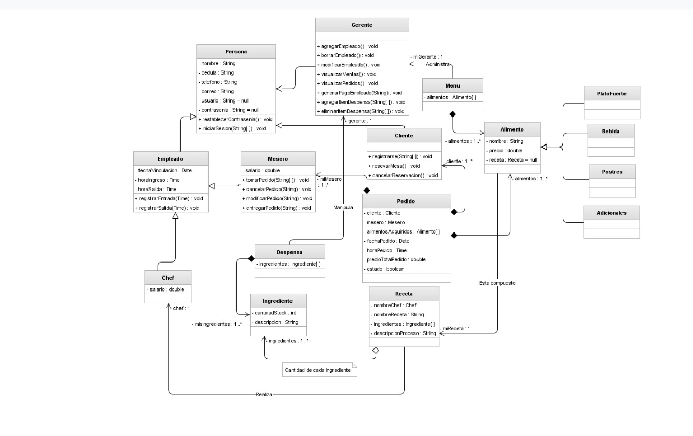

# ProyectoMenu — Sistema de Gestión de Menú
 
Sistema web para la gestión gastronómica de un restaurante. Permite crear menús con sus alimentos, recetas, chefs e ingredientes a través de una interfaz web conectada a una API REST.
 
---
 
## Diagrama UML
 

 
---
 
## Stack
 
| Capa | Tecnología |
|------|------------|
| Backend | Java 17 · Spring Boot · Spring Data JPA · Hibernate |
| Base de datos | MySQL 8 |
| Frontend | HTML · Bootstrap 5 · Vanilla JS |
| Build | Maven |
 
---
 
## Módulos implementados
 
**Gestión**
- **Menús** — Creación de menús con asignación de gerente y alimentos
- **Alimentos** — Cada alimento tiene nombre, precio y una receta asociada
- **Recetas** — Contienen nombre, descripción, chef e ingredientes
- **Chefs** — Personal de cocina con datos personales y salario
- **Ingredientes** — Lista de ingredientes asociados a cada receta
- **Gerentes** — Responsables del menú
**Entidades del diagrama no implementadas**
 
- Cliente, Mesero, Pedido, Despensa, PlatoFuerte, Bebida, Postre, Adicional *(incluidas en el diagrama por requerimiento del docente)*
---
 
## Arquitectura
 
```
ProyectoMenuApplication
├── controllers/    MenuController        → endpoints REST
├── services/       MenuService           → lógica de negocio
├── repositories/   MenuRepository        → Spring Data JPA
└── entities/       clases del dominio
```
 
---
 
## Jerarquía de entidades
 
```
Persona
├── Empleado
│   └── Chef
└── Gerente
 
Menu
└── Alimento (1..N)
    └── Receta (1..1)
        ├── Chef (1..1)
        └── Ingrediente (1..N)
```
 
---
 
## Relaciones en cascada
 
Todas las entidades se guardan y eliminan en cascada desde `Menu`:
 
```
Menu → Alimento → Receta → Chef
                         → Ingrediente
Menu → Gerente
```
 
Esto significa que al crear un menú se persiste toda la estructura en una sola petición, y al eliminarlo se borran todos sus datos relacionados automáticamente.
 
---
 
## Requisitos
 
- Java 17+
- MySQL 8 corriendo en `localhost:3306`
- Maven 3.8+
---
 
## Configuración
 
**1. Crear la base de datos:**
 
```sql
CREATE DATABASE proyectomenu CHARACTER SET utf8mb4 COLLATE utf8mb4_unicode_ci;
```
 
**2. Editar credenciales en `src/main/resources/application.properties`:**
 
```properties
spring.datasource.username=tu_usuario
spring.datasource.password=tu_contraseña
```
 
---
 
## Ejecución
 
```bash
./mvnw spring-boot:run
```
 
La aplicación queda disponible en `http://localhost:9000`.
 
---
 
## Endpoints REST
 
| Entidad | Método | URL | Descripción |
|---------|--------|-----|-------------|
| Menús | GET | `/api/menus` | Obtener todos los menús |
| Menús | POST | `/api/menus` | Crear un menú completo |
| Menús | DELETE | `/api/menus/{id}` | Eliminar un menú |
 
---
 
## Estructura del proyecto
 
```
ProyectoMenu/
├── docs/
│   └── DiagramaMenu.jpeg
├── src/
│   ├── main/
│   │   ├── java/com/example/proyectomenu/
│   │   │   ├── ProyectoMenuApplication.java
│   │   │   ├── controllers/
│   │   │   │   └── MenuController.java
│   │   │   ├── services/
│   │   │   │   └── MenuService.java
│   │   │   ├── repositories/
│   │   │   │   └── MenuRepository.java
│   │   │   └── entities/
│   │   │       ├── Persona.java
│   │   │       ├── Empleado.java
│   │   │       ├── Gerente.java
│   │   │       ├── Chef.java
│   │   │       ├── Menu.java
│   │   │       ├── Alimento.java
│   │   │       ├── Receta.java
│   │   │       └── Ingrediente.java
│   │   └── resources/
│   │       ├── application.properties
│   │       └── static/
│   │           ├── css/
│   │           │   └── styles.css
│   │           ├── js/
│   │           │   ├── crear_menu.js
│   │           │   └── visualQuitar_menu.js
│   │           ├── index.html
│   │           ├── crear_menu.html
│   │           └── visualQuitar_menu.html
└── pom.xml
```
 
---
 
## Validaciones
 
**Backend (Jakarta Validation):** `@NotBlank`, `@Positive`, `@Pattern` en las entidades. Los errores se devuelven como JSON con mensaje descriptivo.
 
**Frontend (JavaScript):** validaciones antes de enviar el formulario, incluyendo formato de correo, teléfono solo números, cédula de 10 caracteres, precio positivo y fecha no futura.
 
---
 
## Notas
 
- Las tablas se crean automáticamente con `spring.jpa.hibernate.ddl-auto=update`
- El guardado de todo el menú se realiza en una sola petición POST gracias al cascade
- El frontend se sirve como archivos estáticos desde Spring Boot
---

## Información Académica

Proyecto realizado para la materia Programación Orientada a Objetos  
Instituto Tecnológico Universitario - 2026  
Profesor: Martin Vargas  

 ---
## Autor
 
Desarrollado por Luciana Torres.
